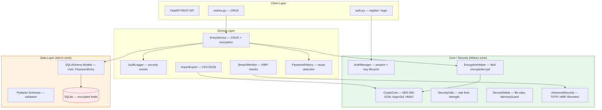

# System Architecture

**Version:** 1.0  
**Date:** April 2026  
**Author:** Nikita (BE1)

---

## Overview

Local-only Windows password manager. No cloud, no network calls at runtime. All user data is encrypted on disk in a SQLite database.

---

## System Diagram



---

## Layer Descriptions

### 1. Core / Security (`backend/core/`) — Nikita (BE1)

| Module | Responsibility |
|---|---|
| `crypto_core.py` | AES-256-GCM encrypt/decrypt, Argon2id key derivation, HMAC-SHA256, HKDF |
| `auth_manager.py` | Session state, auto-lock timer, wrapped master key storage |
| `encryption_helper.py` | Field-level encrypt/decrypt for PasswordEntry |
| `encryption_helper_stub.py` | Stub for CRUD development (no real crypto) |
| `security_utils.py` | Rate limiter, password strength checker |
| `audit_logger.py` | Security event logging (SQLAlchemy, isolated transactions) |
| `secure_delete.py` | Secure file deletion, MemoryGuard, SecureString |
| `advanced_security.py` | TOTP 2FA, recovery codes, HIBP checker, biometric stub |
| `fido2_auth.py` | FIDO2/WebAuthn hardware key support |
| `pypy_optimization.py` | JIT warmup, CPython/PyPy benchmarks |
| `config.py` | Pydantic crypto configuration (frozen, validated) |

**Trust boundary:** Everything in `core/` handles sensitive key material. All `bytearray` keys are zeroed via `zero_memory()` after use.

### 2. Database (`backend/database/`) — Alex (BE2)

| Module | Responsibility |
|---|---|
| `models.py` | SQLAlchemy ORM: User, PasswordEntry (encrypted fields stored as hex strings) |
| `schemas.py` | Pydantic validation: EntryCreateSchema, EntryResponseSchema, etc. |
| `entry_service.py` | CRUD operations: create, read, update, soft-delete, search |

### 3. Features (`backend/features/`) — Alex (BE2)

| Module | Responsibility |
|---|---|
| `breach_monitor.py` | Background HIBP monitoring (passwords + email) |
| `import_export.py` | CSV/JSON import/export with encrypted JSON export |
| `password_history_manager.py` | Password change history, reuse detection |
| `qr_generator.py` | QR code generation for TOTP setup |

### 4. API (`backend/api/`) — Shared

| Module | Responsibility |
|---|---|
| `main.py` | FastAPI application, router registration, exception handlers |
| `dependencies.py` | Database engine, session lifecycle |
| `routers/auth.py` | POST /register, POST /login |
| `routers/entries.py` | CRUD endpoints for password entries |

---

## Data Flow

```
User Request (HTTP)
    ↓
API Router (auth.py / entries.py)
    ↓
EntryService (validates via Pydantic schema)
    ↓
EncryptionHelper.encrypt_entry_fields()  ← writes
EncryptionHelper.decrypt_entry_fields()  ← reads
    ↓
CryptoCore.encrypt() / CryptoCore.decrypt()
    ↓
SQLAlchemy ORM → SQLite file on disk
    ↓
AuditLogger.log() (isolated transaction)
```

---

## Trust Boundaries

```
┌─────────────────────────────────────────────────┐
│  TRUSTED: backend/core/                         │
│  - Handles raw key material (bytearray)          │
│  - All keys zeroed after use                     │
│  - Code review mandatory for any change          │
├─────────────────────────────────────────────────┤
│  PARTIALLY TRUSTED: backend/database/           │
│  - Stores encrypted fields (hex strings)         │
│  - Never sees plaintext passwords                │
│  - Uses EncryptionHelper (never CryptoCore)      │
├─────────────────────────────────────────────────┤
│  UNTRUSTED: backend/api/                        │
│  - Receives raw HTTP input                       │
│  - All input validated through Pydantic schemas  │
│  - Master password passed via X-Master-Password  │
│    header (derived per-request, zeroed after)    │
└─────────────────────────────────────────────────┘
```

---

## SQLite Storage

| Property | Value |
|---|---|
| **File location** | `%APPDATA%/BezPasswordManager/passwords.db` (Windows) or `~/.bez/passwords.db` (fallback) |
| **Encryption** | Individual fields encrypted with AES-256-GCM. Database file itself is NOT encrypted (field-level encryption). |
| **Schema management** | Alembic migrations (see `alembic/` directory) |
| **Backup** | SQLite file can be copied; all data remains encrypted |

---

## OS Boundary

- **Platform:** Windows 10/11 (primary), Linux/macOS (secondary)
- **Data directory:** `%APPDATA%/BezPasswordManager/` on Windows, `~/.bez/` elsewhere
- **No network calls at runtime** — HIBP checks are optional and user-initiated
- **No cloud sync** — all data stays on local disk
- **No external services** — the application is fully self-contained

---

## Network Isolation

The application makes **zero network calls** during normal operation. The only exception is the optional breach monitoring feature (`BreachMonitorService`), which contacts the HIBP API. This is:

1. User-initiated (not automatic)
2. Uses k-anonymity (only 5-char SHA1 prefix sent)
3. Can be fully disabled
4. Email checks require explicit API key configuration
